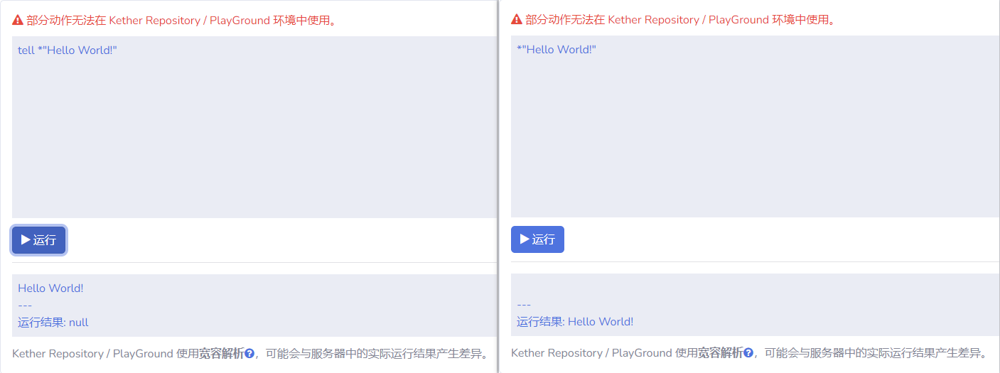

# 动作 Action

## 简介

[匿名动作](https://lanscarlos.gitbook.io/vulpecular/kether-tuo-zhan/qucik-start/action#ni-ming-dong-zuo)



在旧版本的 Kether 官方文档中，“**Action**” 一词翻译为 “**语句**”

而在目前新版本的 Kether 官方文档中，该词已更正为 “**动作**”



在 Kether 中，用来实现不同功能的语句称为动作

其中，动作也被分为 **公有动作** 以及 **私有动作**，关于这两者的区别，我会在下面介绍到 **命名空间** 时讲解

> 此外我认为还应该存在一种叫做匿名动作的分类，具体请看下面分析

这里举两个最常用的动作例子：

[**print <参数1>**](https://kether.tabooproject.org/list.html#Print) 在控制台输出指定信息
> print *Hello! 
> 输出内容：Hello!

[**tell <参数1>**](https://kether.tabooproject.org/list.html#Tell) 向执行者发送指定信息
> tell *"Hello World!" 
> 输出内容：Hello World!

## 动作返回值

大部分动作都会有它的返回值，返回值可能是任意类型，也可能是空值

> 例如动作 [**player name**](https://kether.tabooproject.org/list.html#Name)  
> 当执行者是玩家时，其返回值便是玩家的名字

这些返回值可能会作为参数而去为其他的动作服务

## 动作参数 Token / Action

有些动作可能需要我们提供一个或多个参数才可以正常被执行

例如前面提到的 [**print <参数1>**](https://kether.tabooproject.org/list.html#Print) 动作，你需要向它提供一个参数

## 嵌套动作

有些情况下，我们可能需要用到多个动作，它们往往会构成一种嵌套的结构

下面举几个例子来说：

## 匿名动作 *

顾名思义，就是没有被命名的动作，可能有人会很好奇动作怎么会没有名字

但通过查阅官方文档以及源码后发现，我们经常看到的带 “ **\*** ” 的参数，其本质上就是一种动作，只不过它并没有被命名。准确来说，它们都有一个共同的名字 “ **\*** ”，因此我习惯性称它们为 **匿名动作** 或者 **参数**。

常见的有：`*"Hello World"` `*1` `*0` `*233` `*true` `*heigegeNB`

为了验证这种想法，我们可以前往官方文档实际运行一下这类动作便知



[Kether PlayGround https://kether.tabooproject.org/playground.html](https://kether.tabooproject.org/playground.html)



从结果来看，它们确实是一种动作，一种没有确定的名字，但带有返回值的特殊动作。

## 匿名代码块 Block

代码块