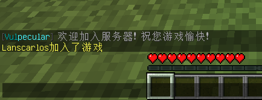

# 配置监听模块

## 配置

首先我们打开处理模块路径内的 def.yml 文件

`<服务器根目录>/plugins/Vulpecular/listener/handlers/def.yml`

可以看到以下内容，这里我们放上前面配置好的 **监听模块 def.yml** 做比对参照



```yaml
# 处理模块的 id
# 可自定义 但请不要与其他处理模块 id 相同
example-handler:
  # 已禁用当前处理模块
  enable: false
  # 绑定的监听模块
  # 支持使用监听模块的别名
  listeners:
    - 'on-quit'
  # 使用 Kether脚本 向后台发送消息
  kether: |-
    print color *"&8[&3Vul&bpecular&8] &7检测到玩家离开了服务器！"

```


```yaml
# 监听模块的 id
# 可自定义 但请不要与其他监听模块 id 相同
player-quit:
  # 禁用当前监听模块，[ 默认为 true ]
  enable: false
  # 监听模块的别名
  aliases: [ 'on-quit', 'quit' ]
  # 定义事件监听优先级 [ 默认为 NORMAL ]
  priority: 'NORMAL'
  # [必填] 监听的事件
  # 这里代表玩家离开服务器事件
  class: 'org.bukkit.event.player.PlayerQuitEvent'

# 玩家进入服务器事件
player-join:
  # 启用监听模块
  enable: true
  # 监听模块的别名
  aliases: [ 'on-join', 'join' ]
  # [必填] 监听的事件
  # 这里代表玩家进入服务器事件
  class: 'org.bukkit.event.player.PlayerJoinEvent'

```



接下来我们同样仿照上面已有的 example-handler 处理模块

自己写一个 welcome-player 处理模块，用来监听 玩家进入服务器事件



```yaml
# 处理模块的 id
# 可自定义 但请不要与其他处理模块 id 相同
example-handler:
  # 已禁用当前处理模块
  enable: false
  # 绑定的监听模块
  # 支持使用监听模块的别名
  listeners:
    - 'on-quit'
  # 使用 Kether脚本 向后台发送消息
  kether: |-
    print color *"&8[&3Vul&bpecular&8] &7检测到玩家离开了服务器！"

# 向进入服务器的欢迎玩家发送一条问候语
welcome-player:
  # 已禁用当前处理模块
  enable: true
  # 绑定的监听模块
  # 支持使用监听模块的别名
  # 这里我们使用监听模块 player-join 的别名 on-join
  listeners:
    - 'on-join'
  # 使用 Kether脚本 向玩家发送问候语
  kether: |-
    tell color *"&8[&3Vul&bpecular&8] &7欢迎加入服务器！ 祝您游戏愉快！"

```


```yaml
# 监听模块的 id
# 可自定义 但请不要与其他监听模块 id 相同
player-quit:
  # 禁用当前监听模块，[ 默认为 true ]
  enable: false
  # 监听模块的别名
  aliases: [ 'on-quit', 'quit' ]
  # 定义事件监听优先级 [ 默认为 NORMAL ]
  priority: 'NORMAL'
  # [必填] 监听的事件
  # 这里代表玩家离开服务器事件
  class: 'org.bukkit.event.player.PlayerQuitEvent'

# 玩家进入服务器事件
player-join:
  # 启用监听模块
  enable: true
  # 监听模块的别名
  aliases: [ 'on-join', 'join' ]
  # [必填] 监听的事件
  # 这里代表玩家进入服务器事件
  class: 'org.bukkit.event.player.PlayerJoinEvent'

```



接下来我们用命令重载一下处理模块的配置文件

`/rl reload handler`

接着进入游戏查看效果

