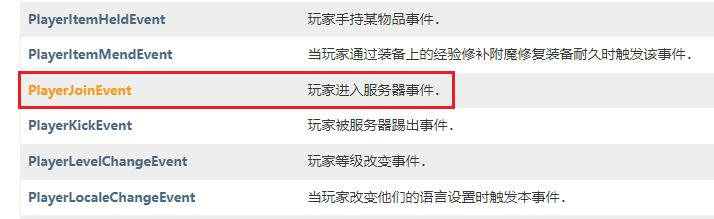
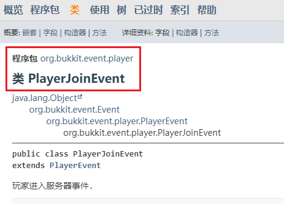

# 配置监听模块

## 配置

首先我们打开监听模块路径内的 def.yml 文件

`<服务器根目录>/plugins/Vulpecular/listener/registrators/def.yml`

可以看到以下内容



```yaml
# 监听模块的 id
# 可自定义 但请不要与其他监听模块 id 相同
player-quit:
  # 禁用当前监听模块，[ 默认为 true ]
  enable: false
  # 监听模块的别名
  aliases: [ 'on-quit', 'quit' ]
  # 定义事件监听优先级 [ 默认为 NORMAL ]
  priority: 'NORMAL'
  # [必填] 监听的事件
  # 这里代表玩家离开服务器事件
  class: 'org.bukkit.event.player.PlayerQuitEvent'

```



接下来我们仿照上面已有的 **player-quit** 监听模块

自己写一个 **player-join** 监听模块，用来监听 **玩家进入服务器事件**



```yaml
# 玩家进入服务器事件
player-join:
  # 启用监听模块
  enable: true
  # 监听模块的别名
  aliases: [ 'on-join', 'join' ]
  # [必填] 监听的事件
  # 这里代表玩家进入服务器事件
  class: '? ? ?'

```



由于 **priority** 选项默认为 **NORMAL** 这里我们可以省略不写

但我们还缺少了一个必填的选项 **class**，这里需要我们填入的是 <mark style="color:purple;">玩家进入服务器事件</mark> 的 **全类名**

那么要如何确定一个事件的全类名呢？

下面我将详细介绍 如何确定一个事件的**全类名**

## 事件全类名

全类名是由 **`程序包名 + 类名`** 组成的一个字符串

要确定 事件全类名，我们得先知道 **事件的类名**，以及 **事件的程序包名**

首先，我们前往 Bukkit 官方文档找到 **玩家进入服务器事件**



[Bukkit 官方文档 - 玩家事件大全<br>https://bukkit.windit.net/javadoc/org/bukkit/event/player/package-summary.html](https://bukkit.windit.net/javadoc/org/bukkit/event/player/package-summary.html)



通过简单检索后，我们找到了 **玩家进入服务器事件** 对应着 **PlayerJoinEvent**，那么这个便是事件的类名了



我们接着点击进入 [**PlayerJoinEvent**](https://bukkit.windit.net/javadoc/org/bukkit/event/player/PlayerJoinEvent.html) 的介绍页面寻找它的程序包名

从文档最上方可以找到关于 PlayerJoinEvent 的以下信息



| 程序包 | 类名 |
| :-- | :-- |
| org.bukkit.event.player | PlayerJoinEvent  |

有了程序包名以及类名，我们不难得出它的全类名就是

`org.bukkit.event.player.PlayerJoinEvent`

我们将它填入上面的 **class** 配置选项中



```yaml
# 玩家进入服务器事件
player-join:
  # 启用监听模块
  enable: true
  # 监听模块的别名
  aliases: [ 'on-join', 'join' ]
  # [必填] 监听的事件
  # 这里代表玩家进入服务器事件
  class: 'org.bukkit.event.player.PlayerJoinEvent'

```



## 重载配置

接下来我们用命令重载一下监听模块的配置文件

`/rl reload registrator`

至此我们完成了监听模块的简单配置入门

